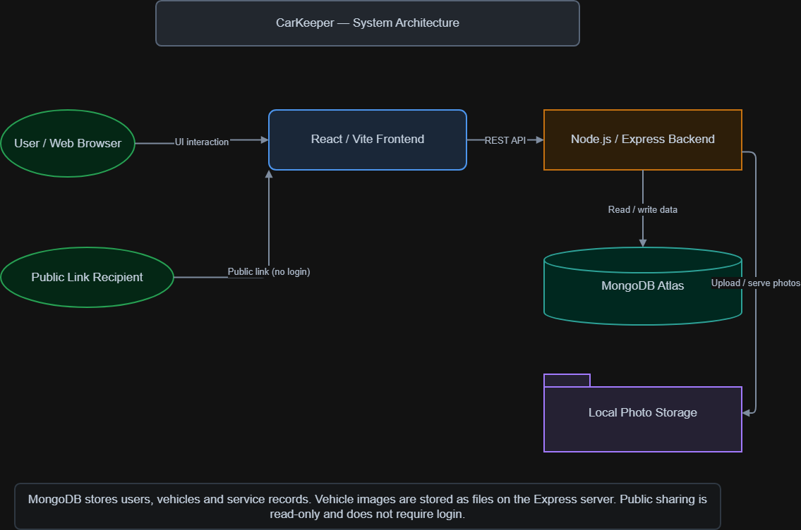
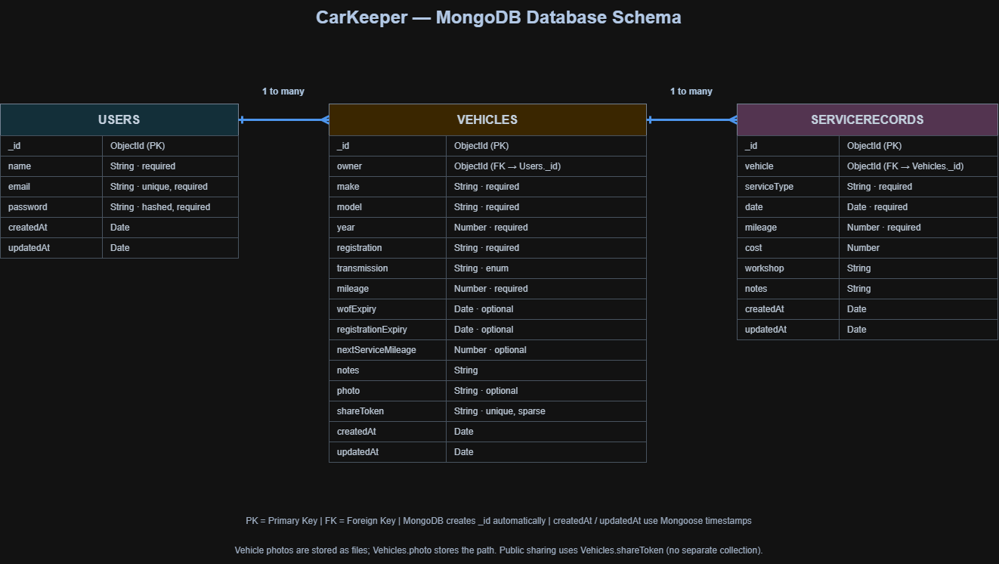

# CarKeeper

**Vehicle Maintenance & Shareable Service History**  
*Institute of Data — Software Engineering Capstone Project | Mark Enriquez | October 2026*

CarKeeper is a full-stack web application for managing personal vehicle details, maintenance records and upcoming maintenance information in one place. Owners can also generate a **revocable, read-only link** to share a vehicle's service history with someone who does not have a CarKeeper account.

> **Project status:** The MVP is implemented and has recorded passing API integration tests. Local development is supported; AWS Elastic Beanstalk deployment remains pending account verification. There is currently **no claimed production deployment or live demo URL**.

## Features

| Area | Functionality |
|---|---|
| Authentication | Account registration, login, JWT authentication and protected owner pages |
| Dashboard | Vehicle summary, upcoming maintenance information and recent service records |
| My Garage | Add, view, update and delete vehicle profiles |
| Vehicle details | Track make, model, year, registration, transmission, mileage, WOF and registration expiry, and next service mileage |
| Vehicle photos | Upload an optional vehicle image, stored as a file on the Express server |
| Service history | Add, view, edit and delete records containing service type, date, mileage, cost, workshop and notes |
| Public sharing | Enable or disable a token-based public link for **read-only** vehicle service history |

CarKeeper is focused on essential personal vehicle maintenance, including New Zealand WOF and registration expiry information. It does **not** automatically verify workshop records or send email/SMS reminders.

## Technology stack

| Layer | Technologies |
|---|---|
| Frontend | React, Vite, React Router, Axios, CSS |
| Backend | Node.js, Express |
| Database | MongoDB Atlas, Mongoose |
| Authentication | JSON Web Tokens (JWT), bcryptjs |
| Photo uploads | Multer, local backend file storage |
| Testing | Jest, Supertest, separate MongoDB test database |
| Development tools | Git, GitHub, Figma, Trello, diagrams.net (draw.io) |

## Project structure

```text
CarKeeper/
├── client/
│   ├── public/
│   └── src/
│       ├── components/
│       ├── context/
│       ├── pages/
│       ├── services/
│       ├── utils/
│       └── App.jsx
├── server/
│   ├── __tests__/
│   ├── controllers/
│   ├── middleware/
│   ├── models/
│   ├── routes/
│   ├── uploads/vehicles/   # generated uploads; not committed
│   ├── app.js
│   ├── server.js
│   └── .env                # local secrets; not committed
├── docs/
│   ├── diagrams/           # editable .drawio files
│   ├── images/             # exported diagrams
│   │   └── user-flows/
│   └── CarKeeper_Capstone_Project_Documentation.docx
└── README.md
```

The Express backend is one modular application; it is **not** a microservices architecture.

## Run locally

### Prerequisites

- Node.js and npm compatible with the project's dependencies.
- A MongoDB Atlas database and connection string.
- Git (if cloning from GitHub).

### 1. Clone the project

```bash
git clone https://github.com/markenrqz/CarKeeper.git
cd CarKeeper
```

### 2. Configure and start the backend

```bash
cd server
npm install
```

Create `server/.env` (or copy your existing `server/.env.example`) and configure your **own** credentials:

```dotenv
PORT=5000
MONGODB_URI=mongodb+srv://<username>:<password>@<cluster>/<database>?retryWrites=true&w=majority
JWT_SECRET=replace-with-a-long-random-secret
```

The connection string and secret above are placeholders. Never commit a real `.env` file. Ensure the database user and Atlas network access rules permit connections from your development machine.

Start the backend:

```bash
npm run dev
```

The API normally runs at `http://localhost:5000`. You can check the basic health response at `http://localhost:5000/`.

### 3. Configure and start the frontend

Open a **second terminal** at the repository root:

```bash
cd client
npm install
npm run dev
```

Open the local URL printed by Vite (usually `http://localhost:5173`). The current frontend API client is configured for `http://localhost:5000/api`, so run the backend on port **5000** unless you also update that configuration.

### 4. Try CarKeeper

1. Register an account and log in.
2. Add a vehicle under **My Garage**; optionally upload a vehicle photo.
3. Open the vehicle and add service records in **Service History**.
4. Review the Dashboard for maintenance information.
5. Enable sharing, copy the public URL, and open it in another browser or private window to view the **read-only** history.
6. Disable sharing and confirm that the old URL no longer grants access.

## Testing

The server has Jest and Supertest API integration tests. The recorded capstone test run completed with **19 passing tests in one passing suite**. It covers registration/login, invalid credentials, unauthenticated vehicle access, vehicle CRUD, service-record CRUD, enabling/disabling sharing, public read-only retrieval, and rejecting a revoked share link.

Run tests from the `server/` directory:

```bash
npm test
```

The project uses a separate MongoDB test database (`carkeeper_test`) for API tests. **Before running tests, verify that your test configuration points to a test database rather than your normal application or production database.** Automated API passes do not by themselves certify accessibility, performance, deployment or every browser workflow.

## Design and project documentation

The diagrams below were produced for the capstone and are available both as previews and as editable draw.io source files.

| Deliverable | Preview | Editable source |
|---|---|---|
| High-level system architecture | [View image](docs/images/system-architecture.png) | [Open draw.io](docs/diagrams/system-architecture.drawio) |
| MongoDB database schema / ERD | [View image](docs/images/database-schema.png) | [Open draw.io](docs/diagrams/database-schema.drawio) |
| Five user flows | [View flow images](docs/images/user-flows/) | [Open draw.io](docs/diagrams/user-flows.drawio) |
| Capstone project documentation | [Word document](docs/CarKeeper_Capstone_Project_Documentation.docx) | — |
| Figma design | [CarKeeper wireframes](https://www.figma.com/design/n9UrRMXAyJO0N67UxRGjOY/CarKeeper?node-id=0-1) | — |

The five user-flow diagrams cover login/registration, main navigation, vehicle management, service history and public sharing. Project planning was tracked in Trello and is documented in the capstone report.

### Architecture overview



### Database design



## Security and privacy

- Passwords are hashed rather than stored in plain text.
- Protected API operations use JWT authentication and owner-specific access checks.
- Public service-history pages are read-only and use a sharing token instead of a recipient account.
- Owners can revoke public access by disabling sharing.
- Environment secrets, `node_modules` and generated vehicle uploads should remain excluded from source control.

**Important:** Shared service histories contain information entered by the vehicle owner; CarKeeper does not independently verify workshop records. Share links should be treated as accessible to anyone who possesses a valid link while sharing is enabled.

## Limitations and future improvements

- **Hosting:** AWS deployment is planned but was not completed because account verification was pending.
- **Image storage:** Vehicle files are stored locally on the Express server; cloud object storage such as Amazon S3 would be more suitable for persistent production hosting.
- **Notifications:** WOF, registration and service information is shown in the app; automated email, SMS or push notifications are not implemented.
- **Receipt uploads:** Allow users to upload and attach receipts, invoices and supporting documents to individual service records
- **Multiple vehicle photos:** Extend the current single-photo feature to support multiple images per vehicle, including a photo gallery with options to add, replace and remove photos.
- **Account management:** Allow users to update their profile information, change their email address and password, and manage account settings.
- **Account security:** Implement email verification during registration, forgot-password functionality and secure password reset links.
- **Scope:** No workshop accounts, workshop-verified entries, fuel analytics, marketplace, or multi-photo gallery are included in this MVP.

## Author

**Mark Enriquez** — Institute of Data Software Engineering Capstone Project, October 2026.
